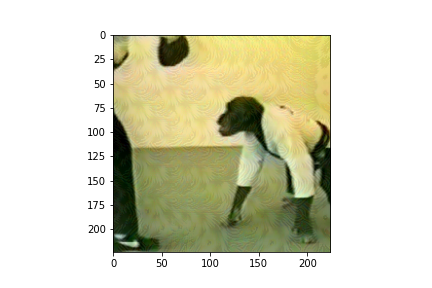
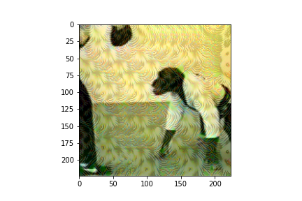
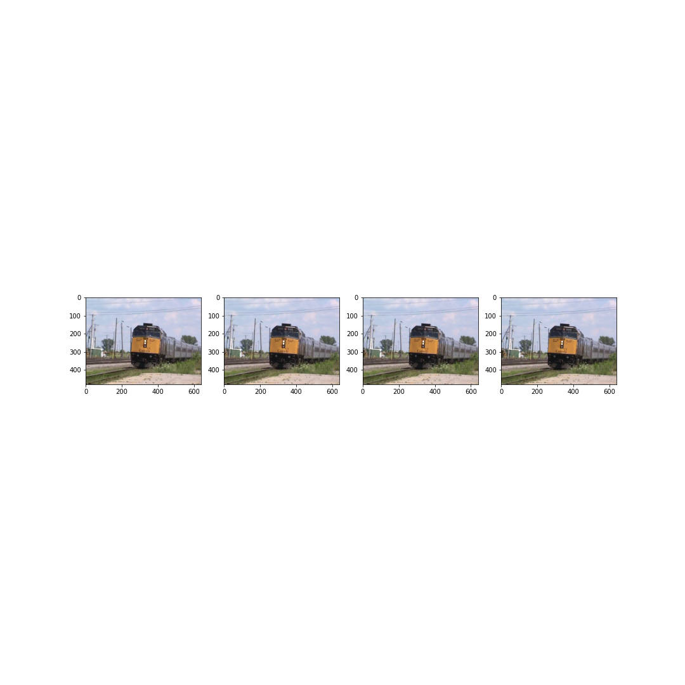
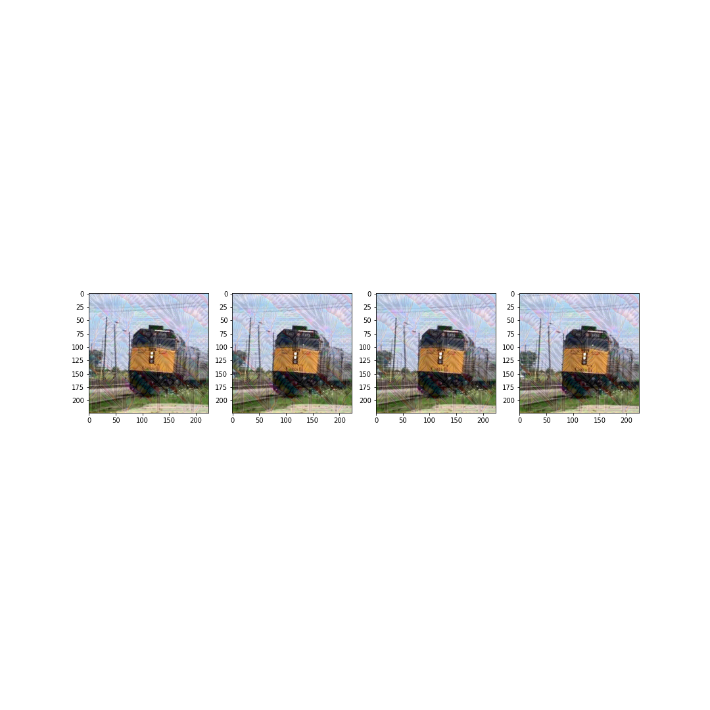
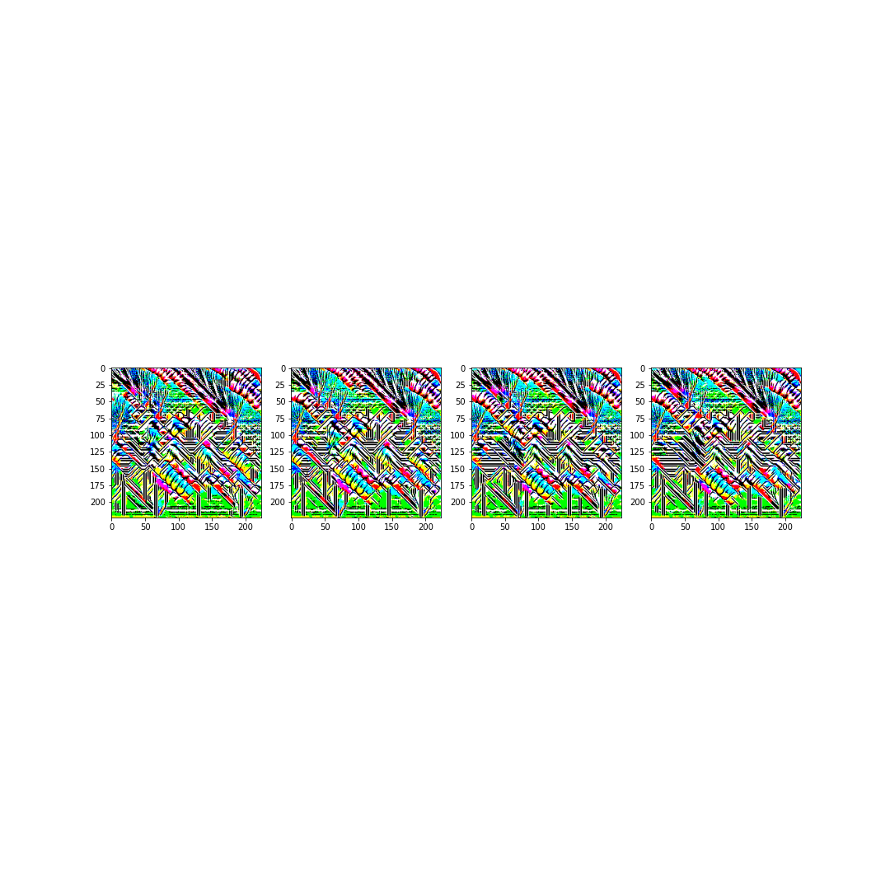

# comse6998_009_final_project
By:
Suman Kalyan Adari (sa3976@columbia.edu)
Reza Abbasian (ra3124@columbia.edu)

Sources:

TREMBA: https://github.com/TransEmbedBA/TREMBA
Imagenette: https://github.com/fastai/imagenette
Video Caption Pytorch: https://github.com/w-garcia/video-caption.pytorch

Previous research collab with Washington Garcia (Github user: w-garcia)
at the University of Florida

# Project

This is the repository for VSHLA, Video Semantic Hard-Label Attack, a novel
framework that targets the CNN bottleneck in video task models.

Our proof of concept is adapted from a previous attempt at proving the same idea
that the CNN can be exploited to semantically influence the target caption.

Here, we contain all the code needed to perform the experiments and plot results.

# Repository Guide:

### configs/

Contains the attack, eval, and generator configurations used by the adversarial
attack algorithm, caption evaluation, and generator training scripts respectively.

### data/

Contains the imagenette training data, adversarial video and original video paths

### eval_models/

Contains pretrained resnet152 and vgg16 MSVD S2VT models

### results/

Contains the evaluation summary of the various adversarial videos

### TREMBA/

Contains some TREMBA related training scripts and attack scripts

### video_caption_pytorch

Contains some scripts needed to run the video captioning evaluation

# How to run

This code uses:

sentence-transformers
PyTorch
FFMPEG
scikit-video
pandas
pretrainedmodels
numpy

## Training TREMBA GAN

1. Edit train_config.json to your liking and anything in generate_configs_trainattack.py

2. run python generate_configs_trainattack.py to create all the configuration
files in config/

3. Tweak train_attacker.py as needed and run: python train_attacker.py

## Running Adversarial Attacks

1. Edit tremba_attack_config.json as needed, generate_configs_trainattack.py as well as commence_attack.py

2. run: python generate_configs_trainattack.py
This generates all attack configurations needed

3. run: python commence_attack.py
This runs the attack experiments

Adversarial results should show up under data/adversarial videos

## Evaluating Adversarial Videos

1. Edit evaluate_config.json, generate_evaluate_configs.py, evaluate_video.py as needed

2. Run: python generate_evalute_configs.py

3. Run: evaluate_video.py

## Combining and Scoring Results

1. Edit score_results.py and tabulate_final_results.py as needed

2. Run: python score_results.py

3. Run: python tabulate_final_results.py 

3. You can run the notebook view_frames.ipynb to view specific videos and perturbations

4. Final results are saved under results/final_results.csv

# Results

Table of Results - Epsilon = 0.0625

| Syntax      | Description |
| ----------- | ----------- |
| Header      | Title       |
| Paragraph   | Text        |

Table of Results - Epsilon = 0.09375

| Syntax      | Description |
| ----------- | ----------- |
| Header      | Title       |
| Paragraph   | Text        |

Effect of Epsilon:

eps = 0.03125
 

eps = 0.0625
 

eps = 0.09375
 

Successful Attack Example:

Original Frames:
 

Adversarial Frames:
 

Adversarial Perturbations:
 

# Takeaways:

- Proof of concept works, and classes more represented in Imagenet (dog) seem to transfer better

- Same architecture transferability seems good but cross-architecture doesn't. Needs further testing

- Modification of objective function during GAN training process to further boost transferability

- Use complex architectures in model ensemble
 
- Train for longer and with finer epsilons

- Attack with lower epsilon values to be more imperceptible 

- More video tasks should be considered with state-of-the-art models + basic defensive training
